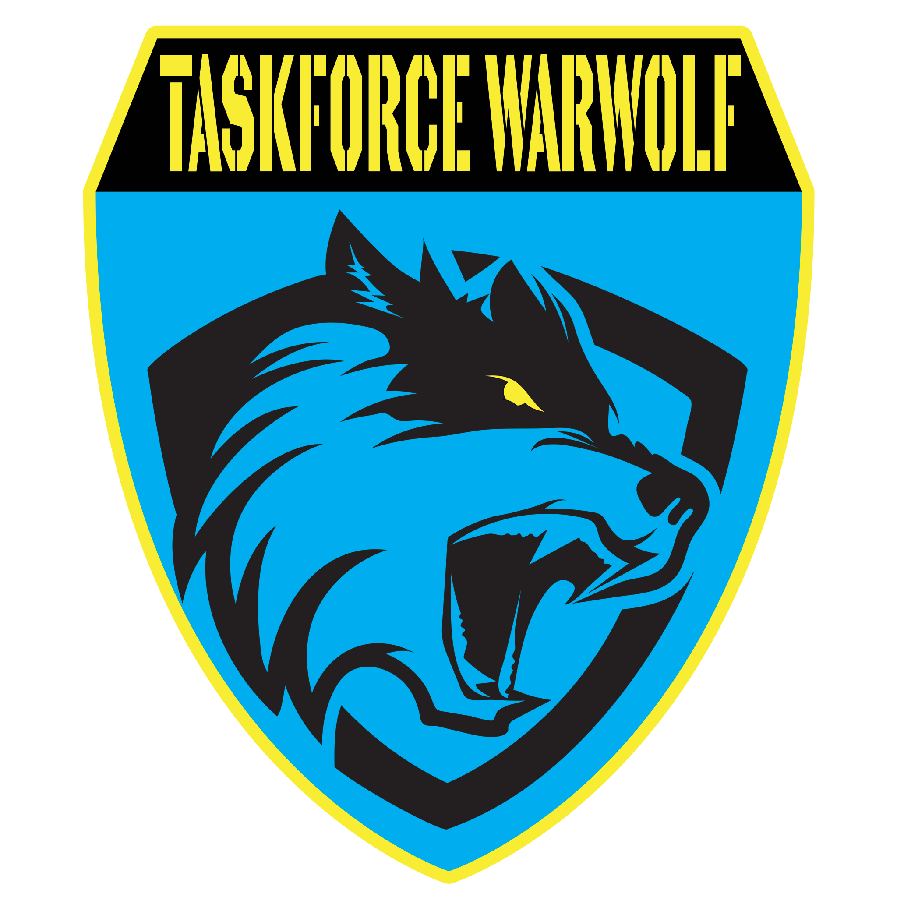

    

    
    
    
    

    <strong>Requires the latest version of <a href="https://github.com/CBATeam/CBA_A3/releases">CBA A3</a> and <a href="https://github.com/acemod/ACE3/releases">ACE3</a>. </strong>

# Tfww Custom Mod

This is the custom mod for Task Force War Wolf 
Its based/inspired on/by the following projects;

##Its based on, and inspired by the following projects
- https://github.com/ArmaForces/Mods of ArmaForces/Mods  -  GNU GENERAL PUBLIC LICENSE
- https://github.com/AXEmod/AXE - GNU General Public License (GPLv3)
- https://github.com/Theseus-Aegis/Mods - GNU General Public License (GPLv2).
- https://github.com/last-resort-gaming/tfww-Fundamentals - MIT License
- https://github.com/Theseus-Aegis/TheseusServices - Official license: Arma Public License Share-Alike (APL-SA)
- https://github.com/task-force-war-wolf/tfww/ - GNU General Public License (GPLv2).
- https://github.com/quies-in-proelium/qipTPL - Creative Commons Attribution-NonCommercial-ShareAlike 4.0 International License.
- https://github.com/Katalam/KNB - GNU General Public License (GPLv3)
- https://github.com/SzwedzikPL/SimpleSuppress/releases - MIT License
- https://github.com/johnb432/Zeus-Additions - MIT License
-https://steamcommunity.com/sharedfiles/filedetails/?id=2869453820  - Arma Public License Share-Alike (APL-SA)

All the code in this mod is available in the Github
you can find the Task Force War Wolf  Version at https://github.com/task-force-war-wolf/tfww

(I know I forgot a few, I will work on getting those mentions put in)

# This mod includes : (per expressed permission on each mods steam page)

Fat_Lurch's
- Turret Enhanced https://steamcommunity.com/sharedfiles/filedetails/?id=1623498241
- MS_IFF_Strobe https://steamcommunity.com/sharedfiles/filedetails/?id=1543390130
- Ammocan https://steamcommunity.com/sharedfiles/filedetails/?id=2162698437
- Vehicle Inventory System https://steamcommunity.com/sharedfiles/filedetails/?id=2161671937

ACE MOD https://steamcommunity.com/workshop/filedetails/?id=463939057
  Compatibility and optional packages
  - No Action Menu
  - No Crosshair
  - No Uniform Restrictions
  - Particles
  - Realistic Dispersion
  - Tracers (ball)

Vestarr's
BettIR (Legacy v0.2.1) https://steamcommunity.com/sharedfiles/filedetails/?id=2260572637

Locky's 
TSF Crye Precision AVS https://steamcommunity.com/sharedfiles/filedetails/?id=2499478882
TSF JPC 2.0 & LV-119  https://steamcommunity.com/sharedfiles/filedetails/?id=2371800141

mjc4wilton's
BackpackOnChest - Redux https://steamcommunity.com/sharedfiles/filedetails/?id=2372036642

RTO-Chatter Chatter Chats
ACE TFAR Long Range Radio Setter  https://github.com/RTO-Chatter/ACE-TFAR-Setter

Huge appreciation and thanks to [ACE3 Team](http://ace3mod.com/team.html) for their open-source nature and permission to use their systems.

## License
This work uses the license Arma Public License Share Alike [Arma Public License Share Alike (APL-SA)](https://www.bohemia.net/community/licenses/arma-public-license-share-alike)

You can freely modify, copy, "cannibalize", to use in your projects.
